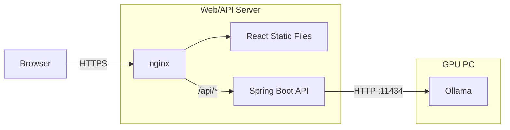
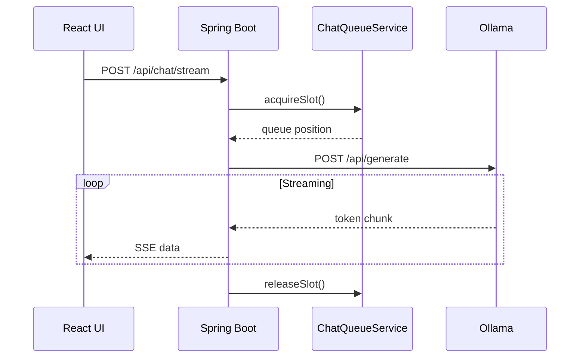

# WhipPT

> 로컬 LLM(Ollama)을 활용한 개인용 AI 챗봇 서비스


## 프로젝트 소개

WhipPT는 로컬 환경에서 구동되는 LLM을 웹 채팅 서비스처럼 사용할 수 있도록 만든 개인 AI 챗봇 프로젝트입니다. 고성능 GPU가 장착된 메인 PC에서는 Ollama 기반 LLM 추론만 수행하고, 저전력 서버는 웹 서비스와 API를 상시 제공하도록 역할을 분리했습니다.

이 구조를 통해 GPU PC를 항상 켜두지 않아도 웹 서비스 자체는 유지할 수 있습니다. Ollama가 꺼져 있거나 접근할 수 없는 경우에는 프론트엔드가 AI 서버 상태를 감지해 입력을 제한하고, 사용자에게 오프라인 상태를 명확히 안내합니다.

## 주요 특징

- **로컬 LLM 연동**: Spring Boot 백엔드가 Ollama API와 통신해 로컬 모델 응답을 제공합니다.
- **실시간 스트리밍 채팅**: Ollama의 스트리밍 응답을 `text/event-stream` 형태로 프론트엔드에 전달합니다.
- **AI 서버 상태 감지**: 프론트엔드가 30초 주기로 `/api/health`를 호출해 Online/Offline 상태를 표시합니다.
- **Graceful Degradation**: Ollama가 오프라인이면 채팅 입력을 막고 안내 화면을 보여 서비스 장애를 사용자에게 자연스럽게 전달합니다.
- **동시 요청 제어**: `Semaphore` 기반 큐로 LLM 동시 추론 수를 제한하고, 대기 중인 요청 수를 UI에 반영할 수 있습니다.
- **로컬 대화 저장**: 대화 목록과 활성 대화를 브라우저 `localStorage`에 저장합니다.
- **Markdown 렌더링**: `react-markdown`, `remark-gfm`, `remark-math`, `rehype-katex`를 사용해 Markdown과 수식 표현을 지원합니다.

## 기술 스택

| 영역 | 기술 |
| --- | --- |
| Backend | Java 21, Spring Boot 4.0.7, WebFlux, WebClient, Reactor |
| Frontend | React 19, Vite 8 |
| AI | Ollama, gemma4 |
| Test | JUnit 5, Reactor Test, MockWebServer |
| Storage | Browser localStorage |

## 시스템 구조



개발 환경에서는 Vite dev server가 `/api` 요청을 `http://localhost:8081`로 프록시합니다. 운영 환경에서는 nginx가 정적 프론트엔드 파일을 서빙하고 `/api/*` 요청을 Spring Boot API로 전달하는 구성을 가정합니다.

## 채팅 요청 흐름



## API

| Method | Endpoint | 설명 |
| --- | --- | --- |
| `POST` | `/api/chat/stream` | 사용자 프롬프트를 Ollama에 전달하고 스트리밍 응답을 반환합니다. |
| `GET` | `/api/health` | Ollama 서버 접근 가능 여부를 `true` 또는 `false`로 반환합니다. |
| `GET` | `/api/queue/status` | 현재 처리 중인 요청 수와 대기 중인 요청 수를 반환합니다. |

### 채팅 요청 예시

```json
{
  "prompt": "로컬 LLM의 장점을 설명해줘"
}
```

### 큐 상태 응답 예시

```json
{
  "activeJobs": 1,
  "waitingJobs": 2
}
```

## 프로젝트 구조

```text
WhipPT/
├── backend/
│   ├── src/main/java/com/whippt/backend/
│   │   ├── config/        # Ollama 설정 및 WebClient 구성
│   │   ├── controller/    # REST/SSE API 컨트롤러
│   │   ├── dto/           # 요청/응답 DTO
│   │   └── service/       # Ollama 연동, 헬스체크, 큐 제어
│   └── src/test/java/     # 백엔드 단위 테스트
├── frontend/
│   ├── src/components/    # 채팅 UI 컴포넌트
│   ├── src/hooks/         # 채팅 스트림, AI 상태, 대화 상태 훅
│   └── src/styles/        # 전역/채팅/입력/사이드바 스타일
└── README.md
```

## 실행 방법

### 사전 준비

- Java 21
- Node.js 22 이상
- Ollama
- 사용할 Ollama 모델

```bash
ollama pull gemma4
```

### 1. Ollama 실행

```bash
ollama serve
```

기본 설정은 `http://localhost:11434`의 Ollama 서버를 사용합니다.

### 2. 백엔드 실행

```bash
cd backend
./gradlew bootRun
```

Windows PowerShell에서는 다음 명령을 사용할 수 있습니다.

```powershell
cd backend
.\gradlew.bat bootRun
```

백엔드는 기본적으로 `http://localhost:8081`에서 실행됩니다.

### 3. 프론트엔드 실행

```bash
cd frontend
npm install
npm run dev
```

브라우저에서 `http://localhost:5173`으로 접속합니다.

## 설정

백엔드 Ollama 설정은 `backend/src/main/resources/application.properties`에서 관리합니다.

```properties
server.port=8081

ollama.base-url=http://localhost:11434
ollama.model=gemma4
ollama.health-timeout-seconds=3
ollama.max-concurrent=1
```

| 설정 | 설명 |
| --- | --- |
| `ollama.base-url` | Ollama 서버 주소 |
| `ollama.model` | 사용할 Ollama 모델 이름 |
| `ollama.health-timeout-seconds` | 헬스체크 타임아웃 |
| `ollama.max-concurrent` | 동시에 처리할 LLM 요청 수 |

GPU PC와 웹/API 서버를 분리해 운영하는 경우 `ollama.base-url`을 GPU PC의 내부 네트워크 주소로 변경하면 됩니다.

## 테스트 및 빌드

### 백엔드 테스트

```bash
cd backend
./gradlew test
```

Windows PowerShell:

```powershell
cd backend
.\gradlew.bat test
```

### 프론트엔드 빌드

```bash
cd frontend
npm run build
```

## 운영 메모

- nginx로 `/api/chat/stream` 같은 SSE 경로를 프록시할 때는 응답 버퍼링을 끄는 설정이 필요할 수 있습니다.
- Ollama는 외부에 직접 노출하지 않고 내부 네트워크에서만 접근하도록 구성하는 것을 권장합니다.
- 현재 대화 데이터는 서버 DB가 아니라 브라우저 `localStorage`에 저장됩니다.
- 인증, 계정, 서버 저장소는 아직 포함되어 있지 않은 개인용 챗봇 구조입니다.

## 라이선스

MIT
